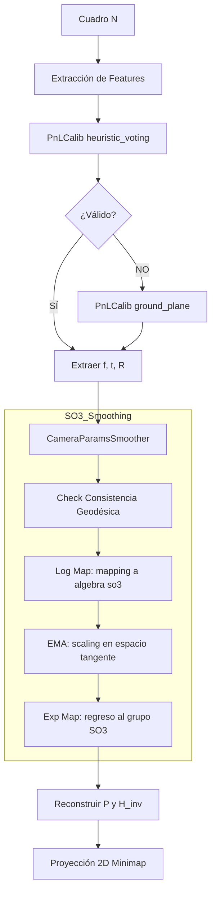

# Estabilización Temporal de la Calibración de Cámara para Reconstrucción 2D en Video de Fútbol

## Tabla de Contenidos

1. [Definición del Problema](#1-definición-del-problema)
2. [Modelo de Cámara: Fundamentos Matemáticos](#2-modelo-de-cámara-fundamentos-matemáticos)
3. [Análisis de Causa Raíz](#3-análisis-de-causa-raíz)
4. [Enfoques Considerados](#4-enfoques-considerados)
5. [Solución Implementada: Decompose → Smooth → Reconstruct (SO(3) Lie Algebra)](#5-solución-implementada-decompose--smooth--reconstruct-so3-lie-algebra)
6. [Referencia de Funciones](#6-referencia-de-funciones)
7. [Justificación de Decisiones de Diseño: ¿Por qué Lie Algebra?](#7-justificación-de-decisiones-de-diseño-por-qué-lie-algebra)

---

## 1. Definición del Problema

### 1.1 Contexto

El pipeline TacticalVision reconstruye una vista cenital (minimap 2D) del campo de fútbol a partir de video de transmisión broadcast. Para lograr esto, cada cuadro del video debe ser **calibrado espacialmente**: se necesita una función matemática que mapee coordenadas de píxel $(u, v)$ en la imagen a coordenadas métricas $(x_w, y_w)$ sobre el plano del campo (105 × 68 metros, norma FIFA).

El modelo **PnLCalib** (Points and Lines Calibration) realiza esta calibración detectando keypoints y líneas del campo en cada cuadro, y estimando los parámetros intrínsecos y extrínsecos de la cámara.

### 1.2 Síntoma Observado

Cuando la cámara de transmisión **rota horizontalmente** (pan) para seguir la acción del juego, el minimapa presenta **saltos bruscos** ("jumping"): los jugadores proyectados cambian de posición abruptamente entre cuadros consecutivos, a pesar de que en la realidad se mueven de forma suave y continua.

### 1.3 Impacto

Este artefacto visual invalida toda la reconstrucción 2D: heatmaps, diagramas de Voronoi, análisis táctico y cualquier métrica espacial derivada del minimapa se vuelven inutilizables.

---

## 2. Modelo de Cámara: Fundamentos Matemáticos

### 2.1 Modelo Pinhole y Matriz de Proyección

Una cámara broadcast se modela matemáticamente como una proyección perspectiva. Un punto 3D en coordenadas del mundo $\mathbf{X}_w = (X, Y, Z, 1)^T$ (coordenadas homogéneas) se proyecta a un punto 2D en la imagen $\mathbf{x} = (u, v, 1)^T$ mediante:

$$\mathbf{x} = \mathbf{P} \cdot \mathbf{X}_w$$

donde $\mathbf{P}$ es la **matriz de proyección** de dimensión $3 \times 4$, que se descompone como:

$$\mathbf{P} = \mathbf{K} \cdot [\mathbf{R} \mid -\mathbf{R}\mathbf{t}]$$

#### 2.1.1 Matriz de Calibración Intrínseca $\mathbf{K}$

$$\mathbf{K} = \begin{pmatrix} f_x & 0 & c_x \\ 0 & f_y & c_y \\ 0 & 0 & 1 \end{pmatrix}$$

donde:
- $f_x, f_y$: distancias focales en píxeles (horizontal, vertical)
- $(c_x, c_y)$: punto principal (generalmente el centro de la imagen)

En una cámara broadcast, $f_x \approx f_y$ (sensor cuadrado) y ambos valores son **casi constantes** durante una secuencia (el camarógrafo rara vez hace zoom).

#### 2.1.2 Parámetros Extrínsecos: Rotación $\mathbf{R}$ y Posición $\mathbf{t}$

- $\mathbf{R} \in SO(3)$: matriz de rotación $3 \times 3$ (ortonormal, $\det(\mathbf{R}) = 1$)
- $\mathbf{t} \in \mathbb{R}^3$: posición de la cámara en coordenadas del mundo

La matriz de transformación extrínseca completa es:

$$[\mathbf{R} \mid \mathbf{d}] = \begin{pmatrix} R_{00} & R_{01} & R_{02} & d_0 \\ R_{10} & R_{11} & R_{12} & d_1 \\ R_{20} & R_{21} & R_{22} & d_2 \end{pmatrix}, \quad \mathbf{d} = -\mathbf{R}\mathbf{t}$$

### 2.2 Descomposición de la Rotación en Ángulos de Euler

La matriz de rotación $\mathbf{R}$ se descompone en tres ángulos de Euler que tienen interpretación física directa para una cámara broadcast:

$$\mathbf{R}^T = \mathbf{R}_{\text{pan}} \cdot \mathbf{R}_{\text{tilt}} \cdot \mathbf{R}_{\text{roll}}$$

donde $\mathbf{R}^T$ es la **orientación** (transpuesta de la rotación):

$$\mathbf{R}_{\text{pan}}(\phi) = \begin{pmatrix} \cos\phi & -\sin\phi & 0 \\ \sin\phi & \cos\phi & 0 \\ 0 & 0 & 1 \end{pmatrix}$$

$$\mathbf{R}_{\text{tilt}}(\theta) = \begin{pmatrix} 1 & 0 & 0 \\ 0 & \cos\theta & -\sin\theta \\ 0 & \sin\theta & \cos\theta \end{pmatrix}$$

$$\mathbf{R}_{\text{roll}}(\psi) = \begin{pmatrix} \cos\psi & -\sin\psi & 0 \\ \sin\psi & \cos\psi & 0 \\ 0 & 0 & 1 \end{pmatrix}$$

- **Pan** ($\phi$): rotación horizontal — cambia cuando la cámara sigue la acción izquierda-derecha
- **Tilt** ($\theta$): inclinación vertical — ángulo entre la cámara y el plano horizontal
- **Roll** ($\psi$): rotación sobre el eje óptico — casi siempre $\approx 0$ (el camarógrafo mantiene la cámara nivelada)

La extracción de ángulos desde $\mathbf{R}$ se realiza mediante (implementada en `rotation_matrix_to_pan_tilt_roll`):

$$\theta = \arccos(R^T_{2,2})$$

$$\phi = \arctan2\left(\text{sgn}(\sin\theta) \cdot R^T_{0,2},\ -\text{sgn}(\sin\theta) \cdot R^T_{1,2}\right)$$

$$\psi = \arctan2\left(\text{sgn}(\sin\theta) \cdot R^T_{2,0},\ \text{sgn}(\sin\theta) \cdot R^T_{2,1}\right)$$

> [!NOTE]
> Existen dos soluciones ($\theta$ y $-\theta$). PnLCalib selecciona la solución con **mínimo roll**, ya que los camarógrafos profesionales mantienen la cámara nivelada.

### 2.3 Homografía del Plano del Campo (Z=0)

Para proyectar jugadores al minimap, solo necesitamos el mapeo sobre el **plano del campo** ($Z = 0$). Sustituyendo $Z = 0$ en $\mathbf{P} \cdot \mathbf{X}_w$:

$$\mathbf{x} = \mathbf{P} \begin{pmatrix} X \\ Y \\ 0 \\ 1 \end{pmatrix} = \begin{pmatrix} P_{:,0} & P_{:,1} & P_{:,3} \end{pmatrix} \begin{pmatrix} X \\ Y \\ 1 \end{pmatrix} = \mathbf{H} \begin{pmatrix} X \\ Y \\ 1 \end{pmatrix}$$

donde la **homografía** $\mathbf{H}$ es la submatriz $3 \times 3$ formada por las columnas 0, 1 y 3 de $\mathbf{P}$ (eliminando la columna de $Z$).

Para ir de la imagen al mundo (dirección que necesitamos), usamos la **homografía inversa**:

$$\begin{pmatrix} X_w \\ Y_w \\ 1 \end{pmatrix} \sim \mathbf{H}^{-1} \begin{pmatrix} u \\ v \\ 1 \end{pmatrix}$$

donde $\sim$ denota igualdad hasta un factor de escala (se normaliza dividiendo por la tercera componente).

### 2.4 Sistema de Coordenadas de PnLCalib

PnLCalib usa un sistema con **origen en el centro del campo**:

$$X_w \in [-52.5, +52.5], \quad Y_w \in [-34.0, +34.0]$$

Para convertir a coordenadas absolutas del campo (origen en esquina superior izquierda):

$$x_{\text{pitch}} = X_w + 52.5, \quad y_{\text{pitch}} = Y_w + 34.0$$

---

## 3. Análisis de Causa Raíz

### 3.1 Causa Raíz #1: PnLCalib es un calibrador de imagen única — sin memoria temporal

> [!CAUTION]
> Este es el problema fundamental. PnLCalib fue diseñado para el benchmark SoccerNet Camera Calibration (imágenes independientes), **NO para video**.

#### El método `heuristic_voting()` — anatomía del problema

Para cada cuadro, `heuristic_voting()` ejecuta internamente **18 combinaciones** de parámetros:

| `mode` | Keypoints usados | `ransac` threshold |
|--------|------------------|--------------------|
| `full` | 57 keypoints + 16 auxiliares + 23 líneas | 0, 5, 10, 15, 25, 50 |
| `ground_plane` | Solo keypoints del plano Z=0 | 0, 5, 10, 15, 25, 50 |
| `main` | 30 keypoints principales | 0, 5, 10, 15, 25, 50 |

Cada combinación ejecuta `cv2.calibrateCamera()` independientemente y produce un **conjunto completo de parámetros** $(\mathbf{K}, \mathbf{R}, \mathbf{t})$. El método selecciona la combinación con menor error de reproyección:

$$e_{\text{reproj}} = \sqrt{\frac{1}{N} \sum_{i=1}^{N} \|\mathbf{x}_i - \hat{\mathbf{x}}_i\|^2}$$

donde $\hat{\mathbf{x}}_i = \pi(\mathbf{P}, \mathbf{X}_{w,i})$ es la proyección del punto 3D $\mathbf{X}_{w,i}$ usando la calibración estimada.

**El problema**: dos cuadros consecutivos pueden seleccionar combinaciones completamente diferentes. Por ejemplo:

| Cuadro | Combinación ganadora | $f_x$ | pan | $e_{\text{reproj}}$ |
|--------|---------------------|--------|-----|---------------------|
| $N$ | `full, ransac=0` | 1200 | +15° | 3.2 px |
| $N+1$ | `ground_plane, ransac=25` | 850 | +22° | 2.8 px |

Ambas tienen bajo error de reproyección, pero parámetros **radicalmente diferentes**. Esto produce un salto de $+7°$ en pan y $-350$ en focal entre dos cuadros consecutivos a 25 fps.

#### El loop de `heuristic_voting()` en pseudocódigo

```
para cada mode en {full, ground_plane, main}:
    para cada ransac en {0, 5, 10, 15, 25, 50}:
        cam_params, err = calibrate(mode, ransac)   ← cv2.calibrateCamera()
        resultados.append((cam_params, err))

ordenar resultados por (err, mode)

si existe (full, ransac=0) con err ≤ 5px:
    retornar ese resultado          ← preferencia por el caso "limpio"
sino:
    retornar el de menor error      ← PUEDE SER CUALQUIER combinación
```

### 3.2 Causa Raíz #2: Suavizado EMA sobre $\mathbf{H}^{-1}$ — matemáticamente inválido

El código original implementaba:

$$\mathbf{H}^{-1}_{\text{smooth}} = \alpha \cdot \mathbf{H}^{-1}_{\text{new}} + (1 - \alpha) \cdot \mathbf{H}^{-1}_{\text{old}}$$

#### ¿Por qué esto es incorrecto?

Una homografía $\mathbf{H}$ pertenece al **grupo proyectivo** $PGL(3)$, no a un espacio vectorial euclidiano. La interpolación lineal de dos matrices en $PGL(3)$ **no produce una transformación proyectiva válida** en general.

Para ilustrar, consideremos dos homografías que representan rotaciones puras de $+10°$ y $-10°$ respectivamente:

$$\mathbf{H}_1 = \mathbf{K} \mathbf{R}(+10°) \mathbf{K}^{-1}, \quad \mathbf{H}_2 = \mathbf{K} \mathbf{R}(-10°) \mathbf{K}^{-1}$$

La interpolación lineal $\frac{1}{2}(\mathbf{H}_1 + \mathbf{H}_2)$ **no es igual** a $\mathbf{K} \mathbf{R}(0°) \mathbf{K}^{-1}$ (la identidad). De hecho, la interpolación lineal puede:

1. **Distorsionar las líneas rectas** del campo (las convierte en curvas)
2. **Mover el punto de fuga** a una posición inconsistente
3. **Colapsar la transformación** si $\mathbf{H}_1$ y $\mathbf{H}_2$ son suficientemente diferentes (determinante cercano a cero)

Para cambios muy pequeños entre cuadros ($\Delta\phi < 0.5°$), la interpolación lineal es una **aproximación de primer orden** razonable por la linealidad local de $PGL(3)$. Pero es exactamente durante **paneos rápidos** ($\Delta\phi > 2°$/cuadro) cuando la aproximación falla — y es exactamente cuando se necesita.

No existía ningún mecanismo para validar que la calibración del cuadro $N+1$ sea **geométricamente consistente** con la del cuadro $N$.

### 3.4 Causa Raíz #4: Limitaciones del Suavizado Euler (Refactorizado)

Aunque el suavizado de ángulos de Euler es superior al de matrices completas, presenta tres problemas matemáticos:
1.  **Singularidades (Gimbal Lock):** Cerca de $\theta = 0$ o $\pi$ (tilt vertical), el pan y el roll se vuelven ambiguos. Pequeños ruidos en la imagen pueden causar saltos de $180^\circ$ en pan y roll simultáneamente que dejan la matriz $\mathbf{R}$ casi idéntica, pero la EMA sobre los ángulos colapsa.
2.  **Métrica de Distancia Incorrecta:** La distancia euclidiana entre dos vectores de ángulos $(\phi_1, \theta_1, \psi_1)$ y $(\phi_2, \theta_2, \psi_2)$ no representa la magnitud real de la rotación entre ellos.
3.  **Interpolación fuera de la Geodésica:** Promediar ángulos de Euler no garantiza que la cámara se mueva por el "camino más corto" (geodésica) en el espacio de rotaciones $SO(3)$.

---

## 4. Enfoques Considerados

### 4.1 Enfoque A: Suavizado EMA mejorado sobre $\mathbf{H}^{-1}$ (descartado)

**Idea**: Mantener el suavizado directo pero con $\alpha$ adaptativo y normalización de $\mathbf{H}^{-1}$ después de cada interpolación.

**Razón de descarte**: Incluso con normalización ($\mathbf{H} / \mathbf{H}_{2,2}$), la interpolación lineal sigue sin ser geométricamente significativa. No hay forma de garantizar que $\alpha \mathbf{H}_1 + (1-\alpha) \mathbf{H}_2$ preserve el significado geométrico de la transformación para diferencias grandes.

### 4.2 Enfoque B: Filtro de Kalman sobre $\mathbf{H}^{-1}$ (descartado)

**Idea**: Tratar los 9 elementos de $\mathbf{H}^{-1}$ como un vector de estado en $\mathbb{R}^9$ y aplicar un filtro de Kalman con modelo de velocidad constante.

**Razón de descarte**:
- Los 9 elementos de $\mathbf{H}$ no son independientes (la homografía tiene 8 grados de libertad, no 9)
- El modelo dinámico lineal ($\mathbf{H}_{t+1} = \mathbf{H}_t + \dot{\mathbf{H}} \cdot \Delta t$) hereda el mismo problema de la interpolación lineal en $PGL(3)$
- La covarianza de proceso sería no trivial de definir en este espacio

### 4.3 Enfoque C: Integración de CMC (Camera Motion Compensation) (evaluado, no prioritario)

**Idea**: Usar las transformaciones afines inter-cuadro estimadas por ORB features (ya computadas en Phase 2: CMC) para propagar la calibración del cuadro anterior.

**Razón de no-priorización**: CMC estima la transformación **relativa** 2D entre cuadros consecutivos, pero no proporciona calibración **absoluta**. Solo podría servir como consistencia check secundario, pero PnLCalib ya provee calibración absoluta que es lo que necesitamos. Añadir CMC incrementaría la complejidad sin resolver el problema fundamental (el ruido de PnLCalib). Se puede integrar en el futuro como verificación cruzada.

### 4.4 Enfoque D ✅: Decompose → Smooth → Reconstruct (Lie Algebra)

**Idea**: Descomponer la calibración, tratar la rotación como un elemento del grupo de Lie $SO(3)$ y realizar el suavizado en su álgebra de Lie $\mathfrak{so}(3)$ (espacio tangente).

**Razón de selección**:
- Elimina singularidades (no hay gimbal lock).
- Garantiza que el suavizado siga la **geodésica** (camino más corto).
- Permite usar una **métrica de distancia geodésica** única para el gate de outliers.
- Es el estándar de "oro" en la industria de rastreo de cámara (tracking) y robótica.

### 4.5 Sub-decisión: Fallback a `heuristic_voting_ground()` (incluido)

**Idea**: Cuando `heuristic_voting()` falla completamente (retorna `None`), usar `heuristic_voting_ground()` que estima solo la homografía del plano del campo.

**Razón de inclusión**: `heuristic_voting_ground()` es más robusto que `heuristic_voting()` en ciertos escenarios porque:
- Solo necesita correspondencias en el plano $Z=0$ (más numerosas)
- Usa `cv2.findHomography()` en vez de `cv2.calibrateCamera()` (menos parámetros → mejor condic## 5. Solución Implementada: Decompose → Smooth → Reconstruct (SO(3) Lie Algebra)

### 5.1 Arquitectura General



### 5.2 Paso 1: Representación de Estado Manifold

A diferencia del enfoque anterior basado en Euler, ahora el estado se almacena como:
1.  **Escalares Euclidiano:** $f_x, f_y, c_x, c_y$ (Focales y Punto Principal).
2.  **Vector Euclidiano:** $\mathbf{t} \in \mathbb{R}^3$ (Posición).
3.  **Elemento de Manifold:** $\mathbf{R}_{smooth} \in SO(3)$ (Rotación como matriz ortonormal).

### 5.3 Paso 2: Validación de Consistencia Geodésica

En lugar de verificar $\Delta\phi, \Delta\theta, \Delta\psi$ por separado, calculamos la **distancia geodésica** única entre la cámara suavizada actual y la nueva medición:

$$\Delta \mathbf{R} = {\mathbf{R}_{smooth}^{(t-1)}}^{-1} \cdot \mathbf{R}_{new}$$

$$\text{distancia} = \| \underbrace{\log(\Delta \mathbf{R})}_{\text{rotvec en } \mathfrak{so}(3)} \|$$

#### 5.3.1 Outlier Gate

| Parámetro | Umbral | Acción si se excede |
|-----------|--------|---------------------|
| Distancia Geodésica | $5^\circ$ | Rechazar frame (Outlier) |
| Error de Reproyección | 20 px | Rechazar frame (Invalid) |

Esto es mucho más robusto ya que detecta cualquier anomalía en la rotación, independientemente de cómo se distribuya entre pan, tilt y roll.
°/cuadro = 125°/s = paneo muy rápido |
| Tilt ($\Delta\theta$) | 3° | Tilt cambia más lentamente que pan |
| Roll ($\Delta\psi$) | 2° | Roll casi nunca cambia en broadcast |
| Focal ($\Delta f / f$) | 20% | Zoom súbito del 20% es extremadamente raro |
| Posición ($\|\Delta\mathbf{t}\|$) | 20 m | Cámara en trípode fijo, no se mueve |

Para ángulos, el cambio se calcula con **diferencia circular** para manejar el wraparound en $\pm\pi$:

$$\Delta\phi = \text{wrap}(\phi_{\text{new}} - \phi_{\text{smooth}})$$

$$\text{wrap}(\delta) = ((\delta + \pi) \mod 2\pi) - \pi$$

Si **cualquier** parámetro excede su umbral, el cuadro completo se rechaza.

#### 5.3.3 Mecanismo de Recuperación

Si se acumulan $N_{\text{max}} = 15$ rechazos consecutivos, se **fuerza la aceptación** con $\alpha$ alto (0.8) para permitir la reconvergencia. Esto maneja el escenario donde la cámara genuinamente se ha movido a una nueva posición (e.g., un corte de cámara o un paneo muy largo).

```
Estado del gate:
  reject_count = 0  →  aceptar normalmente (α = α_nominal)
  reject_count < 15 →  rechazar, hold estado suavizado
  reject_count ≥ 15 →  force-accept (α = 0.8), reset reject_count
```

#### 5.3.4 Período de Warm-up

Los primeros $W = 3$ cuadros se aceptan incondicionalmente con $\alpha = 1.0$ (sin suavizado) para establecer el estado inicial rápidamente. Sin warm-up, los primeros cuadros serían rechazados por el gate (no hay estado previo contra el cual comparar).

### 5.4 Paso 3: Suavizado en el Álgebra de Lie $\mathfrak{so}(3)$

Para las rotaciones, no realizamos promedios numéricos sobre ángulos. Usamos la estructura geométrica de $SO(3)$. El proceso EMA se redefine como:

1.  **Inverse Composite:** Encontrar la rotación relativa entre el estado actual y el nuevo: $\Delta \mathbf{R} = {\mathbf{R}_{smooth}^{(t-1)}}^{-1} \cdot \mathbf{R}_{new}$.
2.  **Logarithmic Map:** Proyectar la rotación relativa al espacio tangente (álgebra de Lie): $\omega = \log(\Delta \mathbf{R})$. Aquí $\omega \in \mathbb{R}^3$ es el vector de rotación.
3.  **Tangent EMA:** Escalar el vector de rotación por el factor de suavizado $\alpha$: $\omega_{smooth} = \alpha \cdot \omega$.
4.  **Exponential Map:** Convertir de regreso al espacio de matrices: $\Delta \mathbf{R}_{smooth} = \exp(\omega_{smooth})$.
5.  **Composition:** Actualizar el estado: $\mathbf{R}_{smooth}^{(t)} = \mathbf{R}_{smooth}^{(t-1)} \cdot \Delta \mathbf{R}_{smooth}$.

#### 5.4.1 Justificación Matemática

Este método garantiza que la rotación suavizada siempre esté en el manifold de rotaciones (es ortonormal por construcción) y que la interpolación ocurra a lo largo de la **geodésica plana** del espacio curvo de rotaciones.

#### 5.4.2 Valores de $\alpha$ por Familia de Parámetros

| Familia | $\alpha$ | Razón |
|---------|----------|-------|
| Rotación ($\mathbf{R}$) | 0.25 | Responsivo al paneo pero filtra jitter |
| Focales ($f_x, f_y, c_x, c_y$) | 0.05 | Casi constantes → $\alpha$ muy bajo |
| Posición ($t_x, t_y, t_z$) | 0.10 | Trípode fijo pero sensor ruidoso |

La elección de $\alpha = 0.25$ para ángulos representa un compromiso: la ventana efectiva de promediado es $\sim 1/\alpha = 4$ cuadros. A 25 fps, esto son 160 ms — suficiente para filtrar ruido cuadro-a-cuadro pero no tanto como para crear lag visible en el minimap.

#### 5.5.1 Rotación SO(3) → Matriz

Ya no necesitamos convertir ángulos de Euler a orientación. Extraemos la matriz directamente:

```python
R_matrix = self.R_smooth.as_matrix()
```

#### 5.5.2 Construcción de $\mathbf{P}$ y Homografía

$$\mathbf{K} = \begin{pmatrix} \hat{f}_x & 0 & \hat{c}_x \\ 0 & \hat{f}_y & \hat{c}_y \\ 0 & 0 & 1 \end{pmatrix}, \quad \mathbf{I}_t = \begin{pmatrix} 1 & 0 & 0 & -\hat{t}_x \\ 0 & 1 & 0 & -\hat{t}_y \\ 0 & 0 & 1 & -\hat{t}_z \end{pmatrix}$$

$$\mathbf{P} = \mathbf{K} \cdot \mathbf{R} \cdot \mathbf{I}_t$$

$$\mathbf{H}^{-1} = \text{inv}\left(\begin{pmatrix} P_{:,0} & P_{:,1} & P_{:,3} \end{pmatrix}\right)$$

> [!IMPORTANT]
> Al realizar el suavizado en $SO(3)$, garantizamos que la cámara reconstruida nunca tenga distorsiones de perspectiva imposibles o efectos de "muelle" (spring) causados por promedios de Euler incorrectos.

### 5.6 Proyección Final: Imagen → Minimap

Dado un punto de pie de jugador $(u, v)$ en la imagen:

$$\begin{pmatrix} X_w \\ Y_w \\ w \end{pmatrix} = \mathbf{H}^{-1}_{\text{smooth}} \begin{pmatrix} u \\ v \\ 1 \end{pmatrix}$$

$$X_w \leftarrow X_w / w, \quad Y_w \leftarrow Y_w / w$$

$$x_{\text{pitch}} = X_w + 52.5, \quad y_{\text{pitch}} = Y_w + 34.0$$

$$u_{\text{minimap}} = \lfloor x_{\text{pitch}} \cdot s \rfloor + m, \quad v_{\text{minimap}} = \lfloor y_{\text{pitch}} \cdot s \rfloor + m$$

donde $s = 8$ px/m es la escala del minimap y $m = 40$ px es el margen.

**Validación de bounds**: si $x_{\text{pitch}} \notin [-5, 110]$ o $y_{\text{pitch}} \notin [-5, 73]$, el punto se descarta (está fuera del campo con un margen de tolerancia de 5 m).

---

## 6. Referencia de Funciones

### 6.1 Clase `CameraParamsSmoother`

| Método | Entrada | Salida | Descripción |
|--------|---------|--------|-------------|
| `__init__()` | — | — | Inicializa estado interno a `None`, contadores a 0 |
| `_wrap(diff)` | $\delta \in \mathbb{R}$ | $\delta' \in [-\pi, \pi)$ | Wrap de diferencia angular |
| `_circular_ema(old, new, α)` | ángulos, peso | ángulo suavizado | EMA circular: `old + α·wrap(new-old)` |
| `_is_consistent(φ,θ,ψ,fx,fy,t,err)` | params nuevos | `(bool, str)` | Gate de consistencia: verifica reproj error + rate-of-change |
| `update(cam_params, rep_err)` | dict PnLCalib, error | $\mathbf{H}^{-1}_{3\times3}$ | Core: descompone → valida → suaviza → reconstruye |
| `_build_H_inv()` | (usa estado interno) | $\mathbf{H}^{-1}_{3\times3}$ | Reconstruye H_inv desde params suavizados |
| `get_current_H_inv()` | — | $\mathbf{H}^{-1}_{3\times3}$ o `None` | Retorna H_inv actual sin actualizar |
| `summary()` | — | `str` | Estadísticas: aceptados/rechazados/force-accepted |

### 6.2 Funciones Auxiliares

| Función | Descripción |
|---------|-------------|
| `build_P_from_cam_params(cam_params)` | Construye $\mathbf{P}_{3\times4}$ desde un dict de PnLCalib |
| `ground_homography_from_P(P)` | Extrae $\mathbf{H}^{-1}$ (ground plane) desde $\mathbf{P}$ |
| `draw_pitch_cv2(scale, margin)` | Renderiza minimap del campo con OpenCV |
| `project_point(u, v, H_inv, ...)` | Proyecta pixel imagen → pixel minimap |

### 6.3 Funciones de PnLCalib (vendor, no modificadas)

| Función | Archivo | Descripción |
|---------|---------|-------------|
| `rotation_matrix_to_pan_tilt_roll(R)` | `utils_calib.py` | $\mathbf{R} \to (\phi, \theta, \psi)$ con min-roll |
| `pan_tilt_roll_to_orientation(φ,θ,ψ)` | `utils_calib.py` | $(\phi, \theta, \psi) \to \mathbf{R}^T$ |
| `FramebyFrameCalib.heuristic_voting()` | `utils_calib.py` | Calibración 3D completa (18 combos) |
| `FramebyFrameCalib.heuristic_voting_ground()` | `utils_calib.py` | Calibración ground-plane (6 combos) |
| `FramebyFrameCalib.get_cam_params()` | `utils_calib.py` | Core: PnP via `cv2.calibrateCamera` |
| `FramebyFrameCalib.get_homography_from_ground_plane()` | `utils_calib.py` | Core: homografía via `cv2.findHomography` |
| `FramebyFrameCalib.from_homography()` | `utils_calib.py` | Extrae $\mathbf{K}, \mathbf{R}, \mathbf{t}$ desde $\mathbf{H}$ (Alg. 8.2, Hartley & Zisserman) |

### 6.4 Pipeline del Main Loop

```
POR CADA cuadro:
  1. Leer imagen
  2. Inferencia HRNet → keypoints + lines
  3. cam.update(kp_dict, lines_dict)
  4. result = cam.heuristic_voting(refine_lines=True)
  5. Si result ≠ None:
       cam_params = result['cam_params']
       rep_err = result['rep_err']
     Sino:
       result_g = cam.heuristic_voting_ground(refine_lines=True)
       Si result_g ≠ None:
         cam_params = extraer de cam.R, cam.t, cam.K
         rep_err = result_g['rep_err']
       Sino:
         cam_params = None   ← fallback
  6. Si cam_params ≠ None:
       H_inv = smoother.update(cam_params, rep_err)
     Sino:
       H_inv = smoother.get_current_H_inv()
  7. Proyectar jugadores y balón con H_inv → minimap
  8. Renderizar frame combinado (video + minimap) al video de salida
```

---

## 7. Justificación de Decisiones de Diseño: ¿Por qué Lie Algebra?

### 7.1 Diferencia entre Euler EMA vs Lie Algebra EMA

| Criterio | Euler EMA (Enfoque anterior) | Lie Algebra EMA (Implementado) |
|----------|----------------------------|---------------------------------|
| **Espacio de Suavizado** | Espacio vectorial $\mathbb{R}^3$ (ángulos) | Manifold curvo $SO(3)$ |
| **Camino de Interpolación** | Arbitrario (depende de la convención de ángulos) | **Geodésica** (mínima rotación) |
| **Singularidades** | Propenso a Gimbal Lock en el polo vertical | **Libre de singularidades** |
| **Métrica de Gate** | 3 umbrales escalares ($\phi, \theta, \psi$) | 1 umbral de distancia geodésica |
| **Integridad de Matriz** | Debe reconstruirse desde ángulos | Propiedades ortonormales intrínsecas |

### 7.2 ¿Por qué EMA y no Kalman?

Un filtro de Kalman (KF) sería teóricamente superior porque:
- Modela explícitamente la incertidumbre de la observación
- Puede usar un prior de velocidad ($\dot\phi, \dot\theta$)
- Produce intervalos de confianza

Sin embargo, para esta aplicación:
- La covarianza de observación de PnLCalib es **desconocida** y varía drásticamente entre cuadros (depende de cuántos keypoints detectó, cuál `mode` ganó, etc.)
- El modelo dinámico de la cámara broadcast no es estrictamente de velocidad constante (el camarógrafo acelera y desacelera)
- La EMA con outlier gating logra el mismo efecto práctico con mucha menos complejidad
- Si en el futuro se quiere pasar a KF, la descomposición en params ya está hecha — solo se reemplaza el step de EMA

### 7.3 ¿Por qué el fallback a `heuristic_voting_ground()`?

`heuristic_voting()` puede fallar (retornar `None`) cuando:
1. Se detectan < 4 keypoints con confianza suficiente
2. Los keypoints caen en una configuración degenerada (colineales)
3. `cv2.calibrateCamera()` no converge

`heuristic_voting_ground()` es más robusto porque:
- Solo necesita correspondencias 2D→2D (no 3D→2D)
- `cv2.findHomography()` solo requiere 4 puntos y es numéricamente más estable que `cv2.calibrateCamera()` (4 DoF vs 6 DoF para extrínsecos + 2 DoF para intrínsecos)
- Las líneas del campo son features extensas que se detectan incluso con motion blur moderado

El tradeoff es que la calibración intrínseca extraída vía `from_homography()` (Algoritmo 8.2 de Hartley & Zisserman) es más ruidosa que la de `cv2.calibrateCamera()`. Pero como el smoother aplica $\alpha_f = 0.05$ a los focales, este ruido se filtra efectivamente.

### 7.4 ¿Por qué mantener `refine_lines=True`?

PnLCalib ofrece un refinamiento post-calibración usando **Levenberg-Marquardt** que minimiza simultáneamente:

$$\mathcal{L} = (1-\alpha_{\text{opt}}) \cdot \|\mathbf{e}_{\text{kp}}\|^2 + \alpha_{\text{opt}} \cdot \|\mathbf{e}_{\text{lines}}\|^2$$

donde:
- $\mathbf{e}_{\text{kp}}$: error de reproyección de keypoints
- $\mathbf{e}_{\text{lines}}$: distancia punto-a-línea para las líneas detectadas
- $\alpha_{\text{opt}} = 0.7$: peso relativo (favorece las líneas)

Este refinamiento mejora la precisión absoluta a costa de ~50-100ms/cuadro. Como el usuario priorizó **precisión sobre latencia**, se mantiene activado. Se puede desactivar con `--disable_pnl_refine` para procesamiento más rápido.

### 7.5 ¿Por qué los umbrales específicos elegidos?

Los umbrales del gate fueron derivados de la cinemática real de una cámara broadcast profesional:

| Parámetro | Velocidad máxima real | A 25fps | Umbral elegido | Factor de seguridad |
|-----------|----------------------|---------|----------------|---------------------|
| Pan | ~100°/s (paneo rápido) | 4°/frame | 5°/frame | 1.25× |
| Tilt | ~50°/s | 2°/frame | 3°/frame | 1.5× |
| Roll | ~5°/s (raro) | 0.2°/frame | 2°/frame | 10× (muy conservador) |
| Focal | Casi nunca cambia | ~0% | 20% | Muy conservador |
| Posición | 0 (trípode fijo) | 0 m | 20 m | Maneja ruido de PnLCalib |

Los factores de seguridad altos garantizan que **nunca se rechace una calibración correcta**. El gate solo filtra saltos que son físicamente imposibles.

---

> [!TIP]
> **Para debugging futuro**: Ejecutar con `--debug` imprime cada 25 cuadros los ángulos suavizados, la fuente de calibración (voting/ground/hold), y el contador de rechazos. Si el minimap sigue inestable, el primer paso es revisar estos logs para determinar si el gate está aceptando demasiados outliers (bajar umbrales) o rechazando demasiados frames buenos (subir umbrales).

---

## Revisión 2026-07-05: auditoría cuantitativa del suavizado Lie ("¿empeoró?")

Motivación: percepción de que el suavizado SO(3) bidireccional empeoró vs el
EMA por ángulo anterior. Se midió con datos, sin recalibrar a ojo.

**Herramientas nuevas** (reproducible):
- `tactical_vision_2d_mapper.py --dump_raw_calib <json>`: vuelca las
  mediciones CRUDAS de PnLCalib por frame (pre-suavizado).
- `scripts/analyze_lie_smoothing.py`: compara variantes de suavizado sobre
  ese dump proyectando 3 puntos fijos de imagen al plano del campo.
  Métricas: jitter (mediana de la 2ª diferencia, m/frame²) y desviación vs
  la trayectoria cruda sana (retardo/deriva, m).

**Resultados en SNMOT-148** (750 frames; 479 con calibración, rep_err
mediana 3.96 px; 2 mediciones crudas insanas — pan espejado ±160-180°,
proyecciones de hasta 600 km):

| variante | jitter med | jitter p95 | desv med | desv p95 |
|---|---|---|---|---|
| crudo (sin suavizar) | 0.568 | 15.74 | 0 | 0 |
| EMA forward puro (≈ CameraParamsSmoother viejo) | 0.006 | 0.27 | **1.11** | **10.32** |
| Lie forward (ESKF-Lite) | 0.019 | 0.33 | 0.77 | 8.35 |
| **Lie bidireccional (producción)** | 0.048* | 0.48 | **0.82** | **7.77** |
| Gauss fase-cero offline (referencia) | 0.010 | 0.76 | 0.29 | 13.54 |

(*medido solo sobre frames con calibración real tras el fix de huecos.)

**Veredicto: el suavizado Lie NO empeoró.** Tiene ~25 % menos retardo mediano
y mejor p95 que el EMA viejo, con jitter igualmente controlado (12x por
debajo del crudo); los gates rechazan correctamente los outliers espejados
de PnLCalib. El EMA viejo era más "liso" pero arrastraba la cámara hasta
10 m en paneos.

**La causa real de la percepción**: SNMOT-148 tiene **271/750 frames (36 %)
sin calibración** (un hueco de 238 frames ≈ 9.5 s + uno de 26). El suavizador
rellenaba TODOS los huecos sosteniendo/promediando cámara, así que el
minimapa dibujaba jugadores en posiciones FICTICIAS durante ~10 s y
`tracking_2d.csv` alimentaba analytics con esas posiciones (con `gap==1`,
sumaban distancia/velocidad fantasma).

**Fix aplicado** (`BidirectionalLieSmoother.MAX_GAP_FILL_FRAMES = 25`):
los huecos de medición > 25 frames (~1 s) quedan SIN H_inv tras el merge —
minimapa sin puntos y sin filas fabricadas en el CSV (analytics ya exige
`gap==1` para computar velocidad, así que el hueco suma 0 en vez de
ficción). Huecos cortos se siguen rellenando (deseable). En SNMOT-148:
264 frames invalidados; las métricas de suavizado sobre los frames reales
no cambian.

**Trabajo futuro** (no aplicado): la referencia offline gauss fase-cero con
rechazo de outliers logra 3x mejor fidelidad mediana (0.29 m) — el mapper ya
es de dos pasadas, así que un suavizador batch (spline/gauss robusto) es
legítimo y dominaría en tramos continuos; requiere cuidar los bordes de
hueco (sus picos p95 vienen de interpolar cerca de outliers de borde).

---

## 2026-07-05 (b): suavizador offline robusto promovido a PRODUCCIÓN

El "trabajo futuro" de la revisión anterior se implementó, validó y promovió
el mismo día a pedido del usuario ("lo mejor para la mayoría de los casos").

**`RobustOfflineSmoother`** (`--smoothing_mode robust_offline`, default del
mapper; `lie_bidir` queda disponible como fallback):
1. Rechazo por rep_err (>20 px) y por **proyección insana** (3 puntos de
   imagen proyectados fuera de ±120×80 m — atrapa las soluciones espejadas
   de PnLCalib que llegan con rep_err aceptable).
2. Rechazo por **residuo vs mediana deslizante** del rotvec (ventana 11,
   umbral 4°) — outliers aislados.
3. Interpolación lineal + **filtro gaussiano de fase cero** (σ=3) sobre
   rotvec/focal/principal point/posición. Fase cero = sin retardo
   direccional; legítimo porque el mapper ya es de dos pasadas (offline).
4. Huecos de medición >25 frames siguen quedando SIN H_inv.

**Validación en dos secuencias** (proyección de puntos fijos, m):

| | SNMOT-148 (36% sin calib) | SNMOT-116 (100% calibrada) |
|---|---|---|
| | jit_med / dev_med / dev_p95 | jit_med / dev_med / dev_p95 |
| Lie bidireccional (anterior) | 0.048 / 0.821 / 7.77 | 0.054 / 0.567 / 2.62 |
| **Robusto offline (prod)** | **0.014 / 0.251 / 3.37** | **0.016 / 0.334 / 2.37** |

Domina en TODAS las métricas en ambas: ~3.3x menos jitter, ~2-3x más fiel,
picos p95 menores. La clase reproduce bit-exacto la variante
`gauss ROBUSTO (cand)` de `scripts/analyze_lie_smoothing.py` (verificado
max|ΔH_inv| = 0 en ambas secuencias).

Rechazos en SNMOT-148: 8 por rep_err, 1 insana, 23 por mediana (los
espejados de los bordes de hueco); SNMOT-116: 1+1+0 (748/750 aceptadas).
